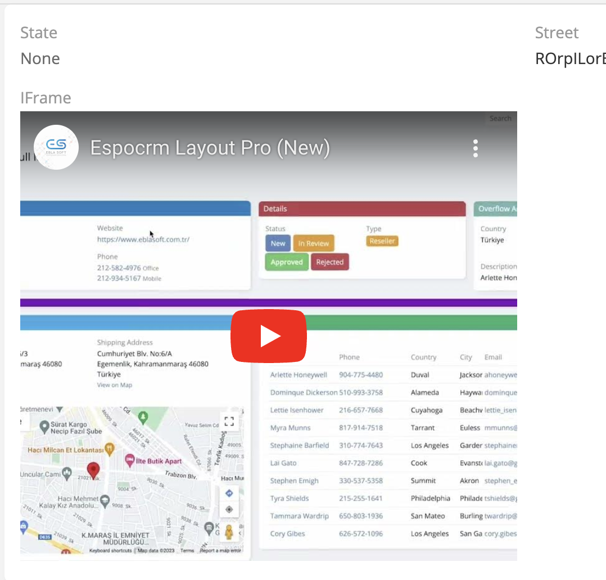
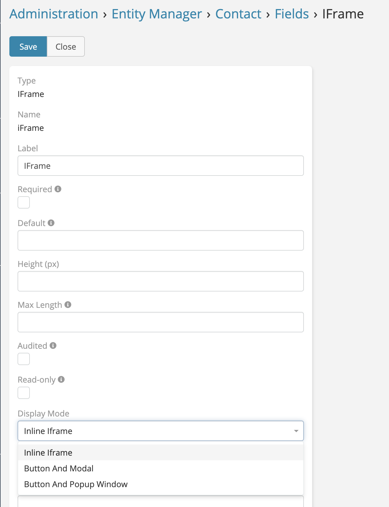

# Iframe Field

> Iframe field available in [Ebla Iframe](https://www.eblasoft.com.tr/espocrm-extension-page/espocrm-i-frame-field).
> It allows you to embed external web pages into EspoCRM.
---

---

1. Go to **Administration** -> **Entity Manager** -> **{Entity Type}** -> **Fields** .
2. Create a new field with type **Iframe**.

 