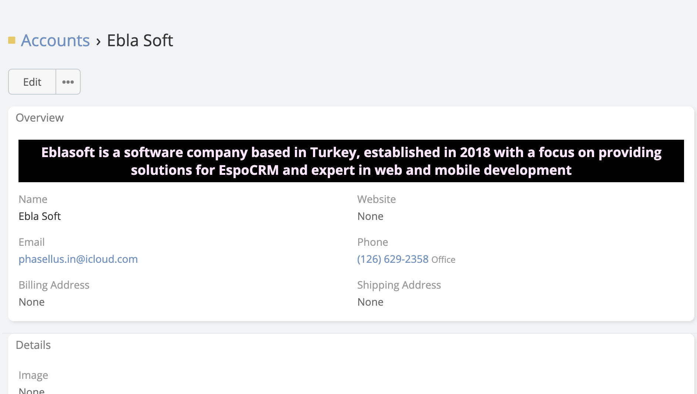
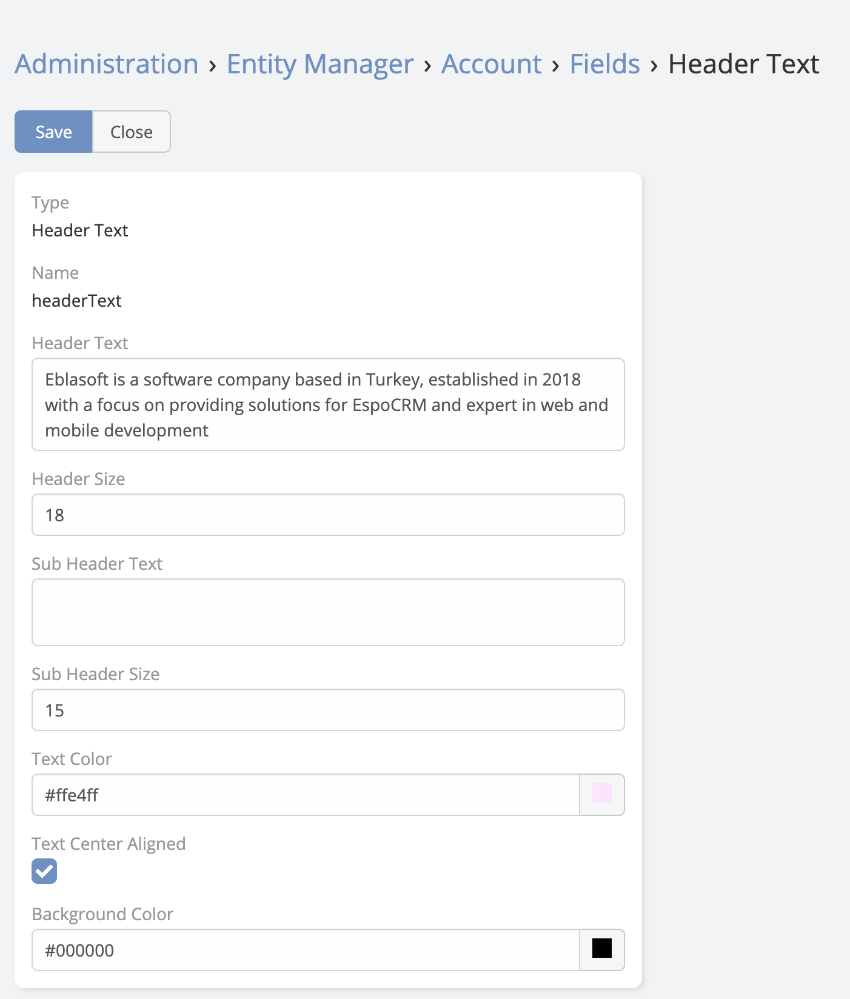

# Header Text

Header Text is a new type of field in EspoCRM is available
in  [Ebla Labels](https://www.eblasoft.com.tr/espocrm-extension-page/labels-cells).

---

go to **Admin** -> **Entity Manager** -> **{Entity Type}** -> **Fields** -> **Add Field** -> **Header Text**.

