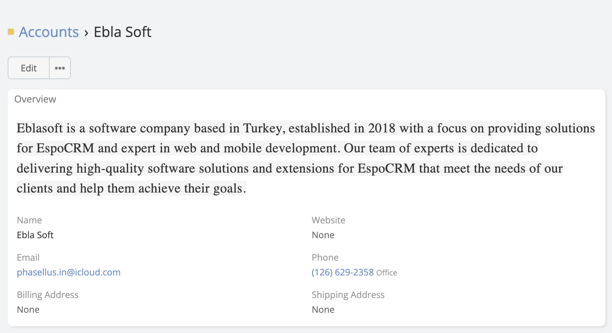
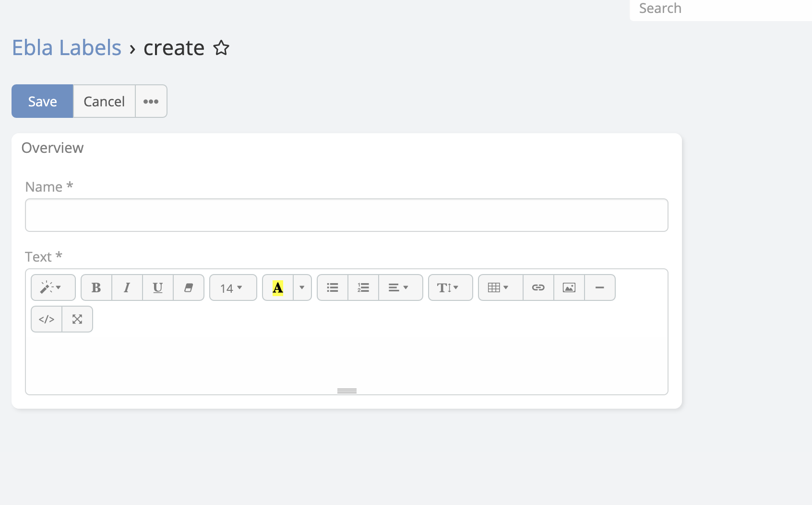
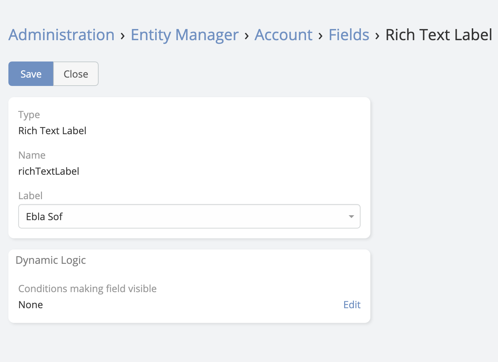

# Rich Text Label

> Rich Text Label is a new type of field in EspoCRM is available
> in  [Ebla Labels](https://www.eblasoft.com.tr/espocrm-extension-page/labels-cells).
---

---

1- go to **Administration** -> **Ebla Labels**.

---

2- Create a new **Rich Text Label**.

3- go to **Admin** -> **Entity Manager** -> **{Entity Type}** -> **Fields** -> **Add Field** -> **Rich Text Label**.

4- Select the **Rich Text Label**.

