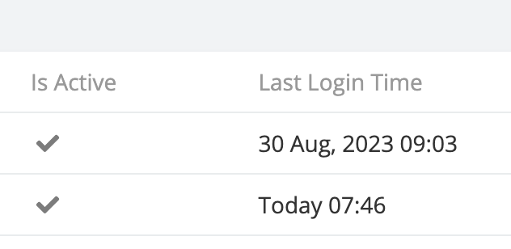

# Last Login  

> Add date-time column to user entity show last login time in EspoCRM is available
> in [Ebla Last Login](https://www.eblasoft.com.tr/espocrm-extension-page/last-login).
 
---

 

** [Changelog](changelog.md) **