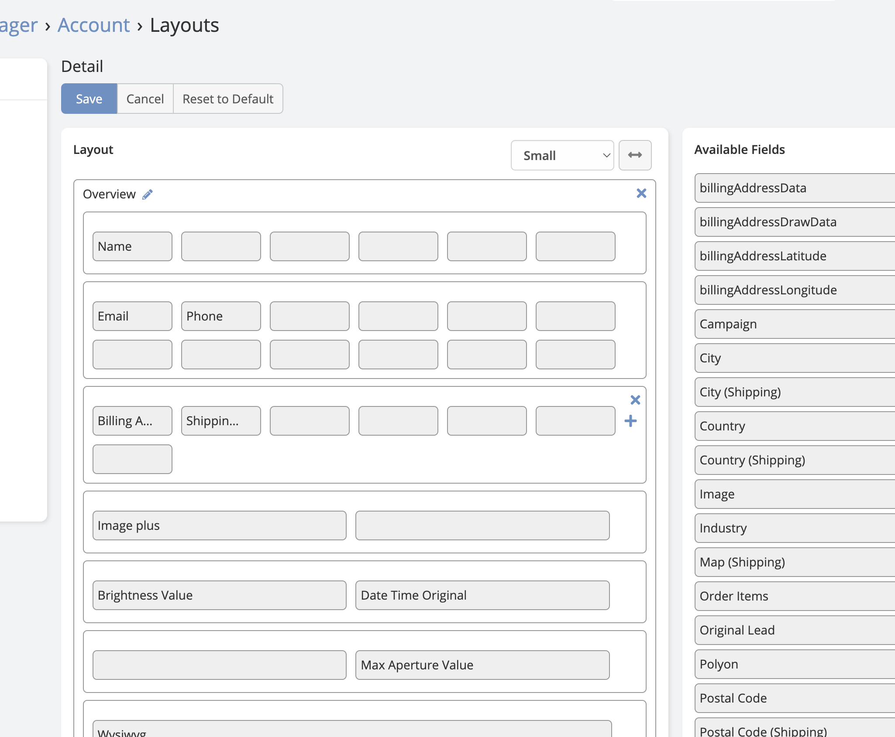
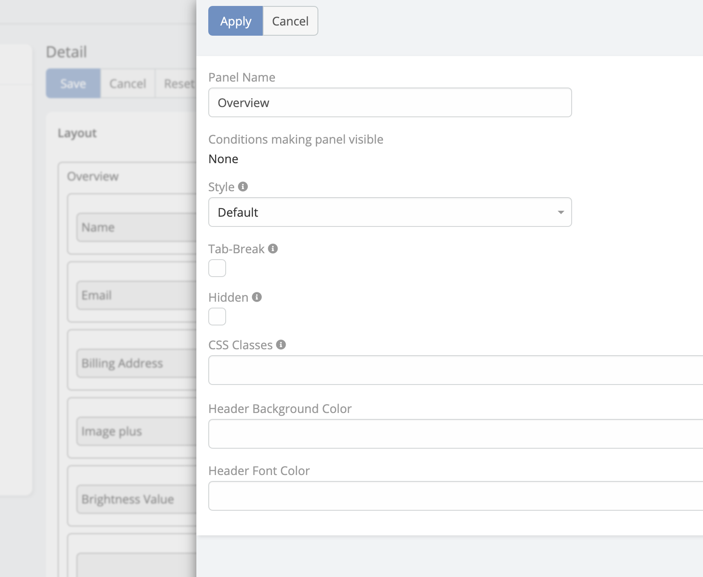
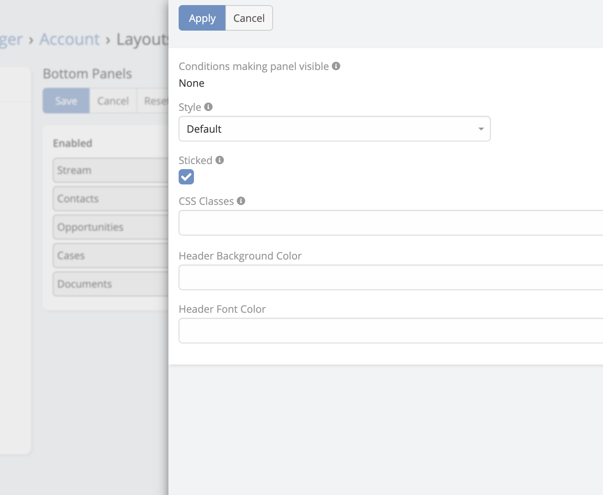
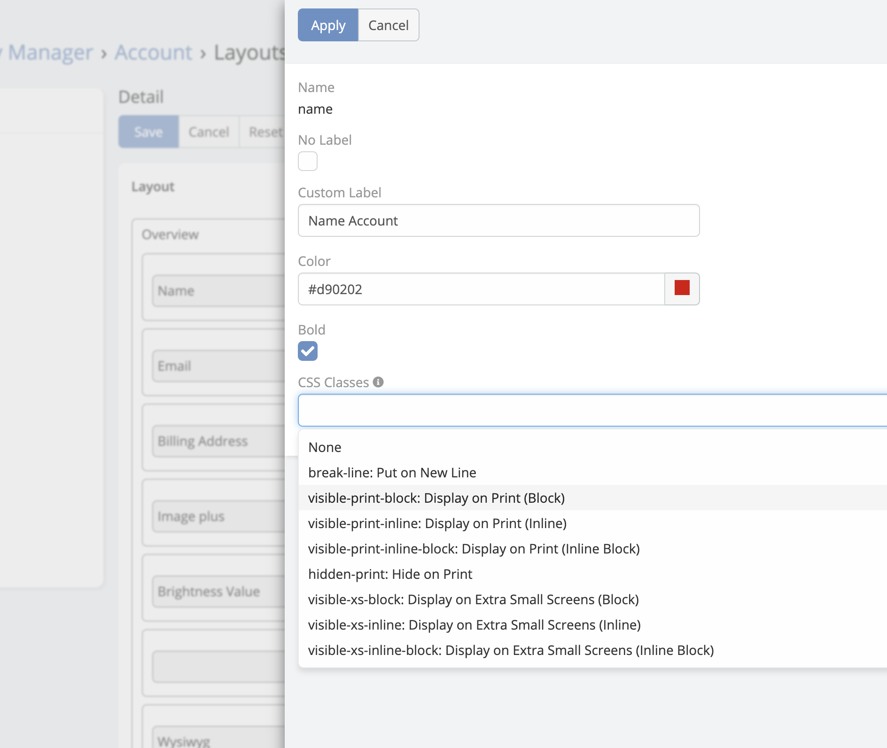
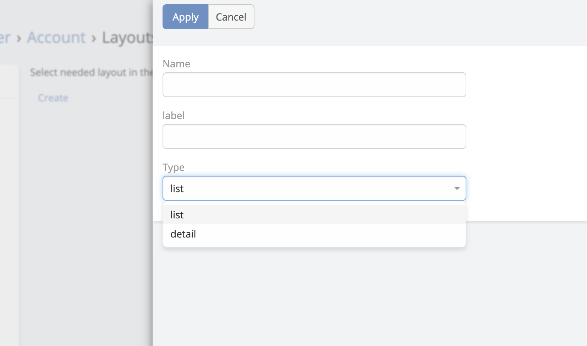

# Grid Layout

Gird Layout is available in [Ebla Layout Pro](https://www.eblasoft.com.tr/espocrm-extension-page/espocrm-layout-pro).

---

**Features:**

* [12 columns](#12-columns)
* [Panel Customisation](#panel-customisation)
* [Field Customisation](#field-customisation)
* [Bottom Panels Customisation](#bottom-panels-customisation)
* [Wide Detail View](#wide-detail-view)
* [Create Additional Layout (detail , list)](#create-additional-layout-detail-list)

### 12 Columns

---

!!! note

    EspoCRM support maximum 4 equals cells per row by default.

---

### Panel Customisation:

1. CSS Classes
2. Header Background Color
3. Header Font Color

---

### Bottom Panels Customisation:

1. CSS Classes
2. Header Background Color
3. Header Font Color

---

### Field Customisation:

1. No Label
2. Custom Label
3. Font Color
4. Font Bold
5. Css Class

---

### Wide Detail View:

**-** Go to **Administration**-> **Entity Manager** -> **{Entity Type}** -> **Edit** .

* Full Detail is Wide
* Small Detail is Wide

---

### Create Additional Layout (detail , list):

!!! note

    EspoCRM just support list layout by default.

