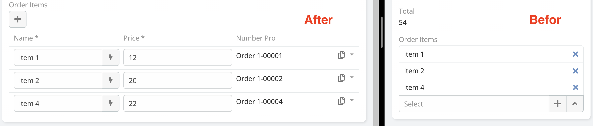
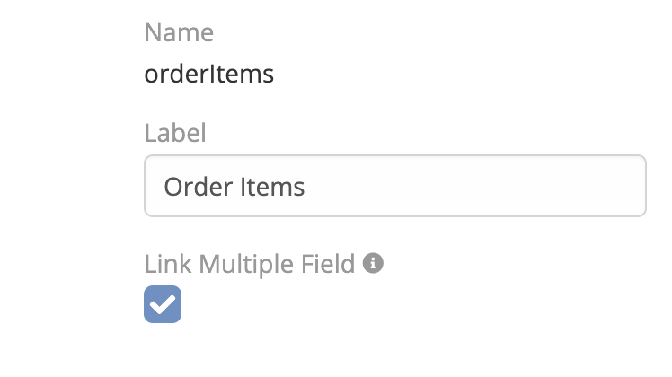
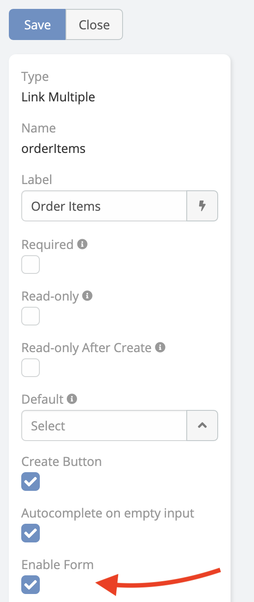
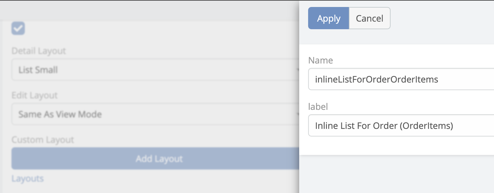
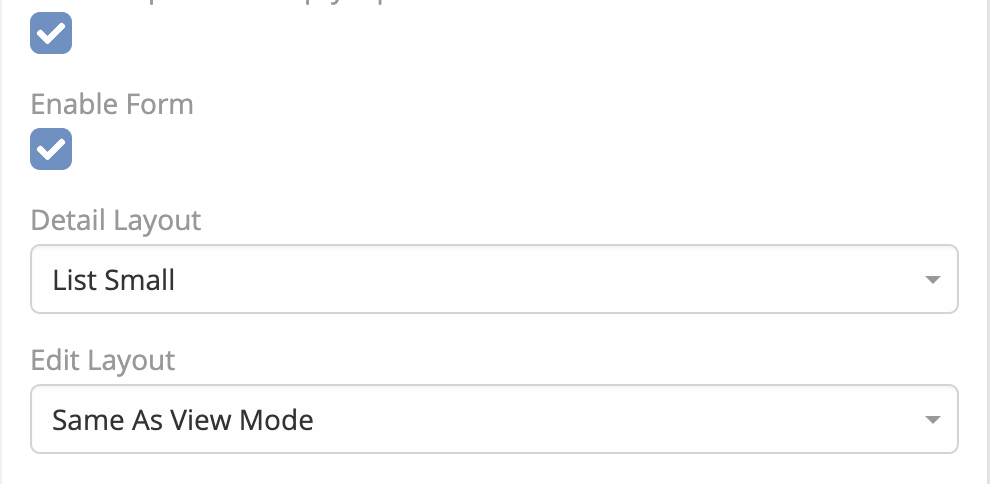
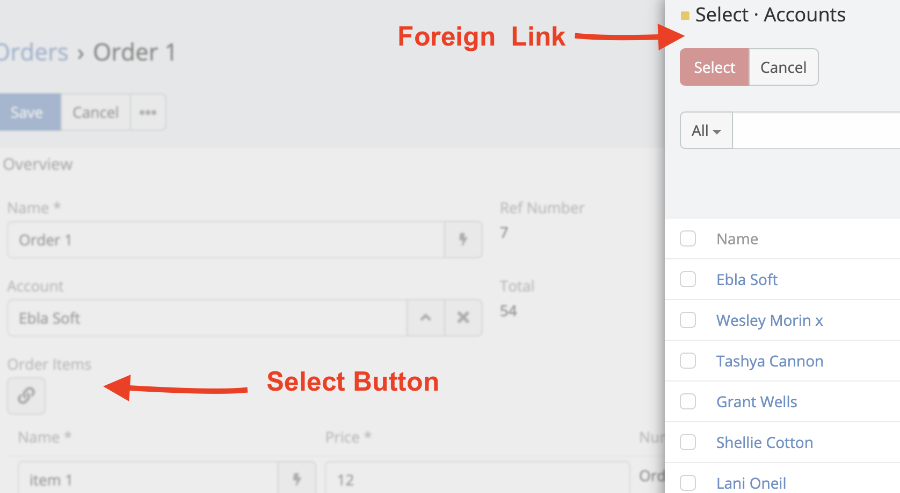
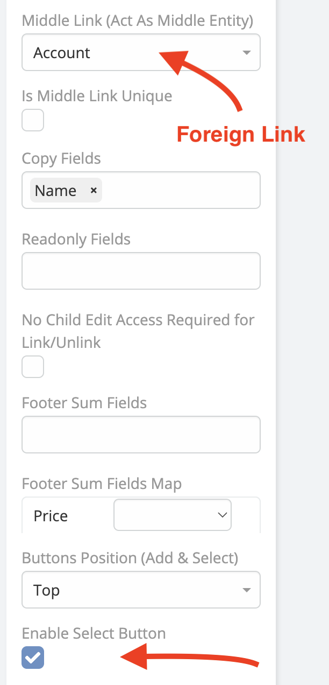
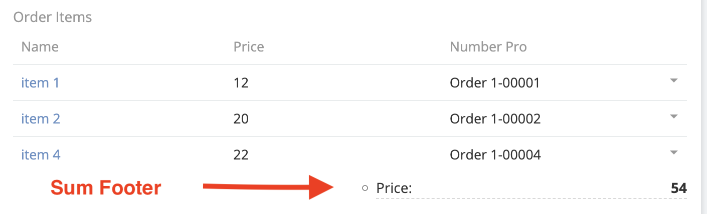
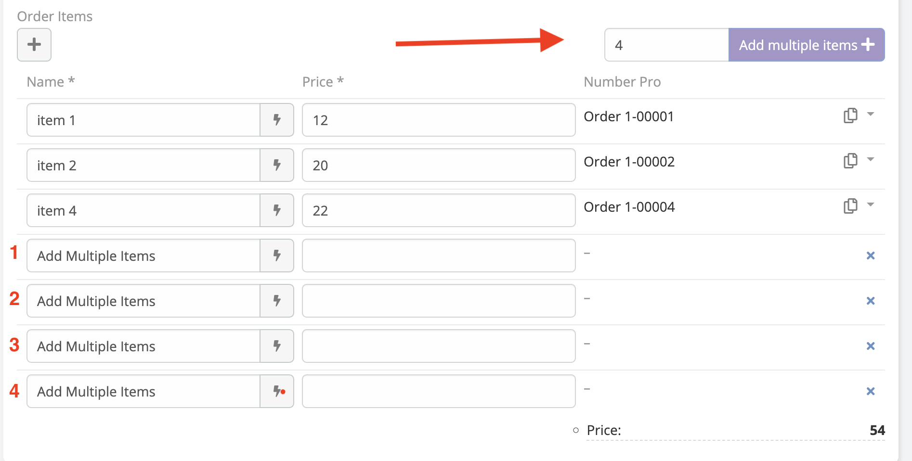

# Link Multiple Pro 

> Basically this extension allows you to render link multiple fields in the list view in EspoCRM.
> Invoice items on invoice entity

---

<iframe width="650" height="315" src="https://www.youtube.com/embed/fvllcGJhKNg" frameborder="0" allow="accelerometer; autoplay; clipboard-write; encrypted-media; gyroscope; picture-in-picture" allowfullscreen></iframe>

---

1. Go to **Administration** -> **Entity Manager** -> **{Entity Type}** -> **Relationships** -> **Link Multiple Field**.

2. Go to **Administration** -> **Entity Manager** -> **{Entity Type}** -> **Fields** -> **Field Type (Link Multiple)
   ** -> **Enable Form** .

---

 

Additional Features:

### Additional list layouts for the linked entity.

- Create a new list layout for the linked entity and add it to the link multiple field.

### Different layouts for edit and detail modes.

- select the layout for edit and detail modes.

### Enable Select Button

 

### Sum Footer Fields.

### Enable Add Multiple Button.

!!! note

    For   "Many To Many"  usage cases please consider to read [this article](https://www.eblasoft.com.tr/post/link-multiple-pro-many-to-many).

 

###  [ChangeLog](changelog.md) 