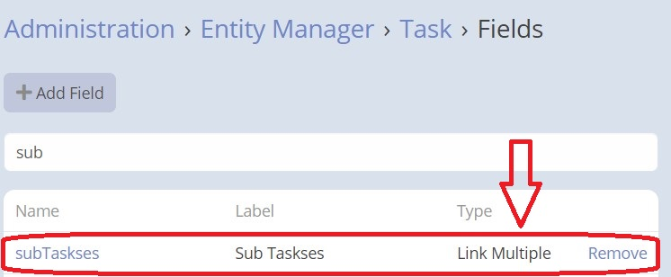
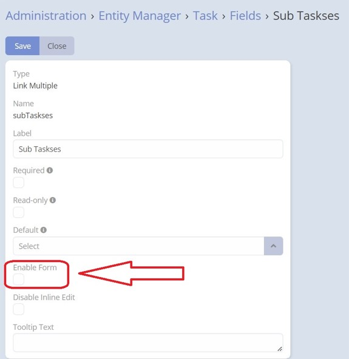
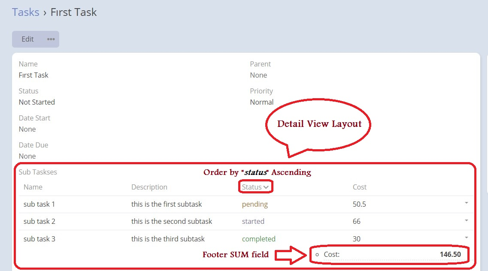

## Overview

> Basically this extension allows you to render link multiple fields in the list view.
> Invoice items on invoice entity

---

<iframe width="650" height="315" src="https://www.youtube.com/embed/fvllcGJhKNg" frameborder="0" allow="accelerometer; autoplay; clipboard-write; encrypted-media; gyroscope; picture-in-picture" allowfullscreen></iframe>

---

**1.** Create a relationship between two entities of type one-to-many. Make sure to enable the "link multiple field"
option to enable this extension.

**2.** After enabling the "link multiple field" option, a new field of type "link multiple" will be added to the fields
of the parent entity. You can find this field in the entity manager.

**3.** Edit the properties of the newly added multiple link field check the "enable form" option.

**4.** To verify your configuration, view the detail record of the parent entity that has this multiple link field. You
should be able to see the changes you have made and interact with the multiple link field accordingly.

 

###  [ChangeLog](changelog.md) 