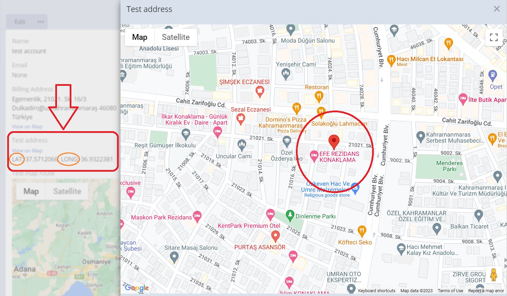
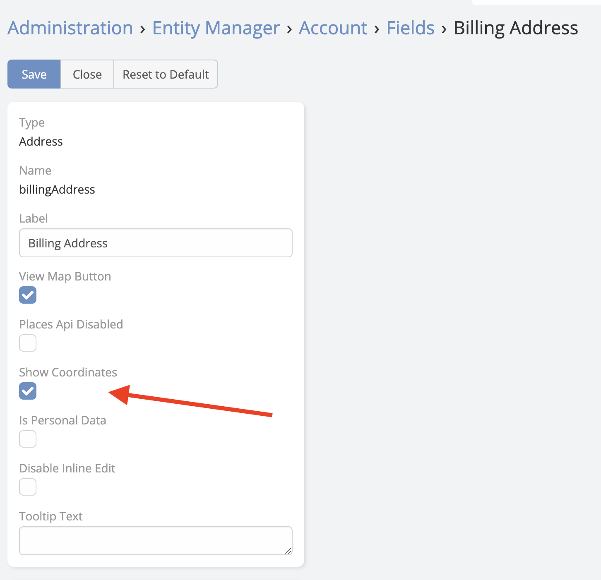

# Latitude and Longitude

Latitude and Longitude is available in [Ebla Map Plus](https://www.eblasoft.com.tr/espocrm-extension-page/espocrm-map-extension).
___

> The existing **Address** field type now includes two additional inputs, latitude and longitude in EspoCRM.

 

---

**-** Go to **Administration** -> **Entity Manager** -> **{Entity Type}** -> **Fields** .

 

