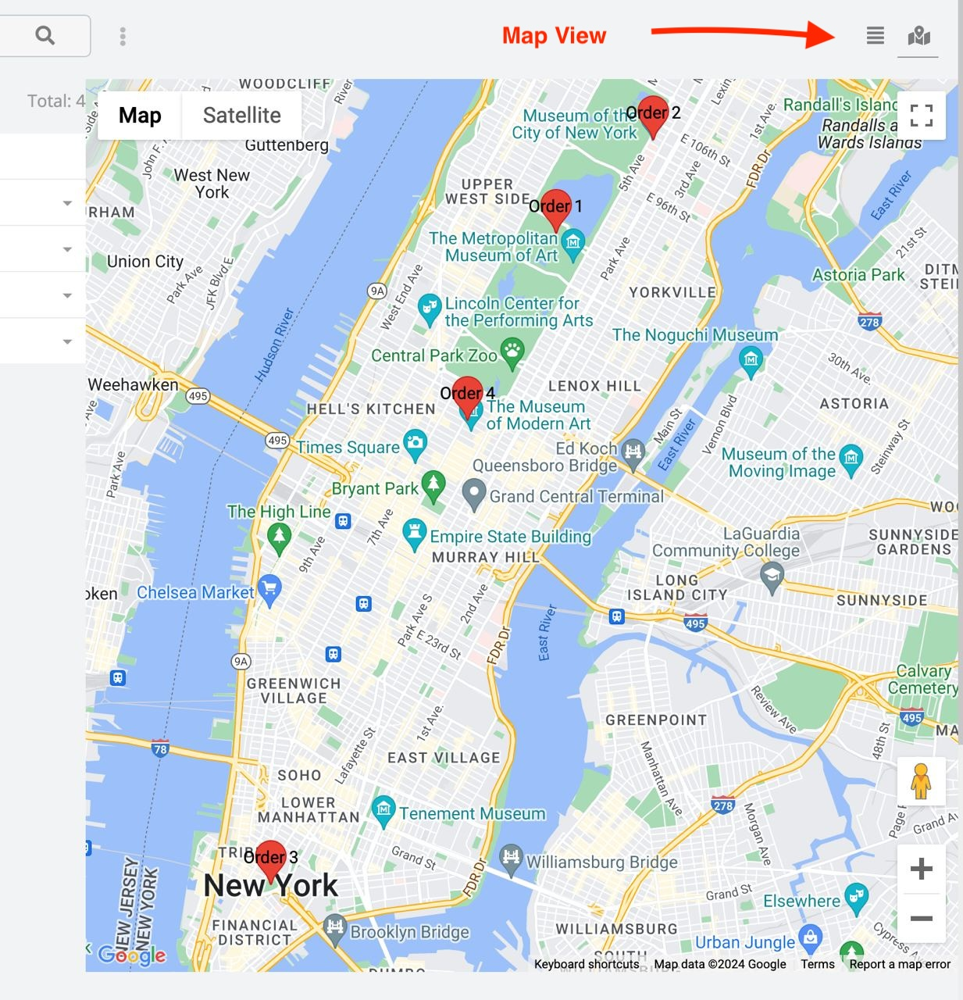
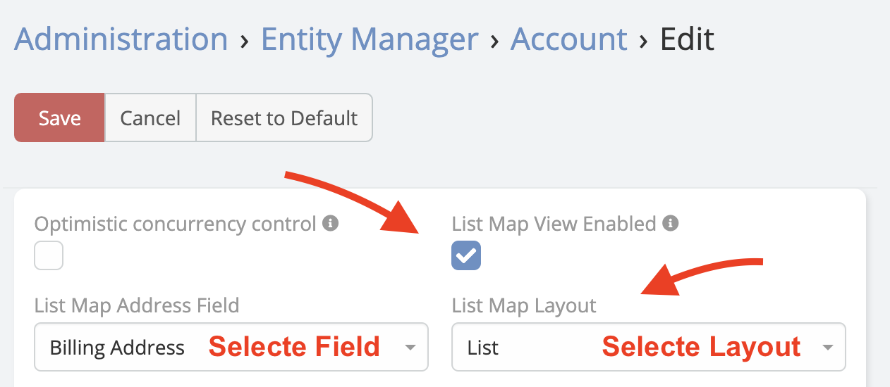

# Map View

Map View is available in [Ebla Map Plus](https://www.eblasoft.com.tr/espocrm-extension-page/espocrm-map-extension).

> The new **Map View** allows users to view records on a map in EspoCRM.

---

---

1. Go to **Administration** -> **Entity Manager** -> **{Entity Type}** -> **Edit** .

