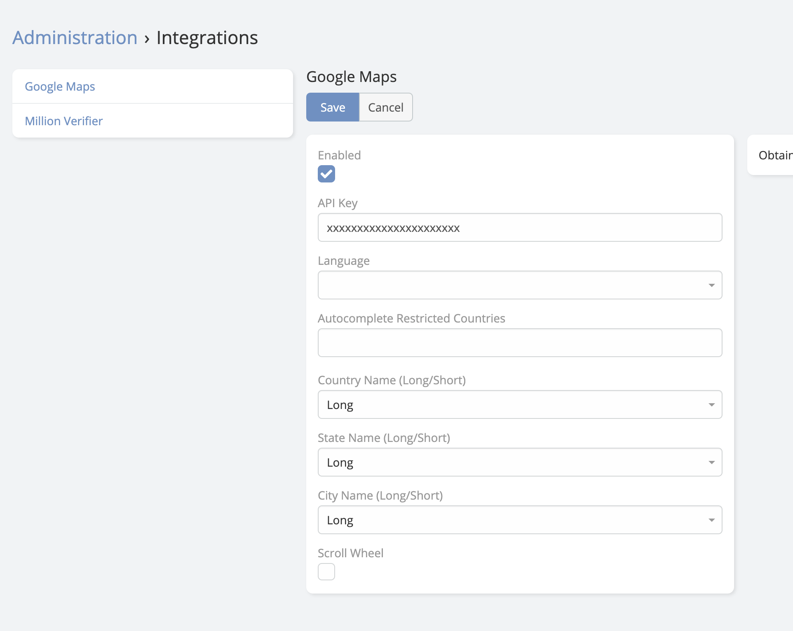

# Map Field 

> This extension enhances the existing **address** field type in EspoCRM.
> is available in [Ebla Map Plus](https://www.eblasoft.com.tr/espocrm-extension-page/espocrm-map-extension).

 
<iframe width="650" height="315" src=" https://www.youtube.com/embed/Cu9MdF8_LVM" frameborder="0" allow="accelerometer; autoplay; clipboard-write; encrypted-media; gyroscope; picture-in-picture" allowfullscreen></iframe>
 

---

### Setup

1. You need to [get your API Key](https://developers.google.com/maps/documentation/places/web-service/get-api-key) .

2. Go to **Administration** -> **Integrations** -> **Google Maps**.

 

###  [ChangeLog](changelog.md) 

