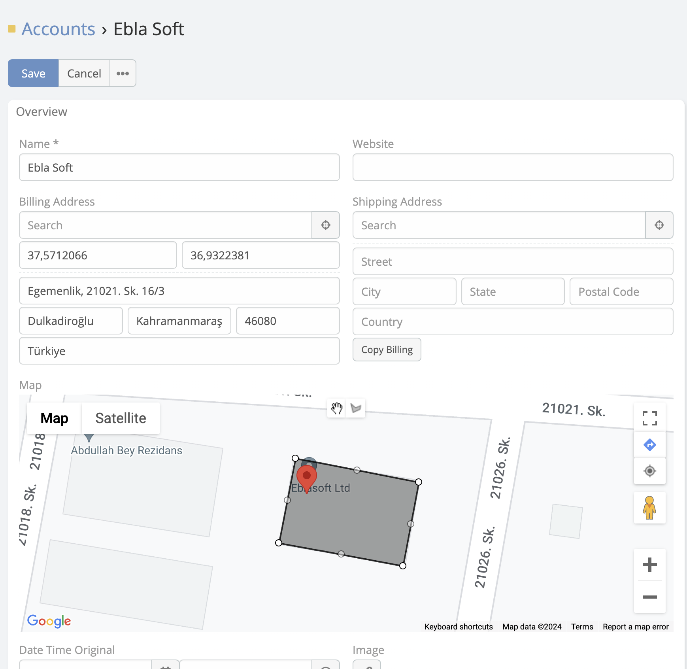
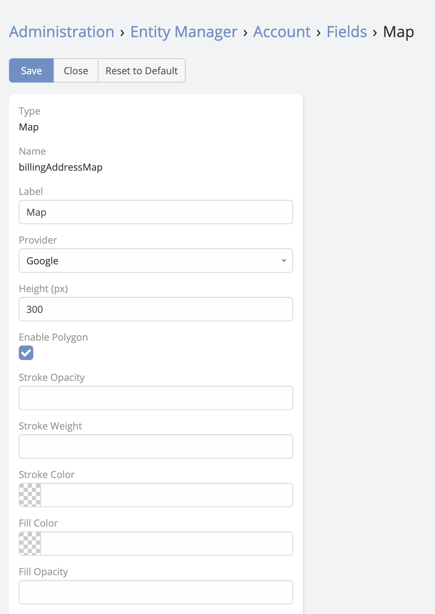

# Polygon  Map

> The new **[Polygon Map](https://developers.google.com/maps/documentation/javascript/examples/polygon-simple)**  in
> **Map Filed** type in EspoCRM allows users to plot a polygon on a map.
> Polygon Map is available in [Ebla Map Plus](https://www.eblasoft.com.tr/espocrm-extension-page/espocrm-map-extension).

 
---

1. Go to **Administration** -> **Entity Manager** -> **{Entity Type}** -> **Fields**
2. Type field **Map**

