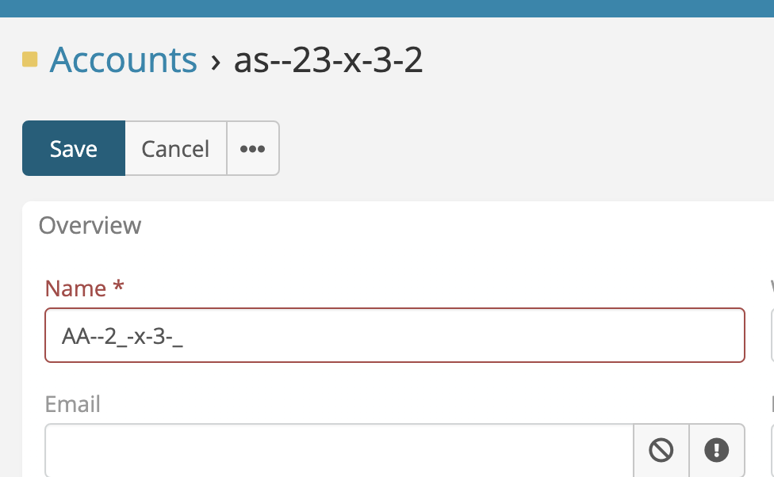
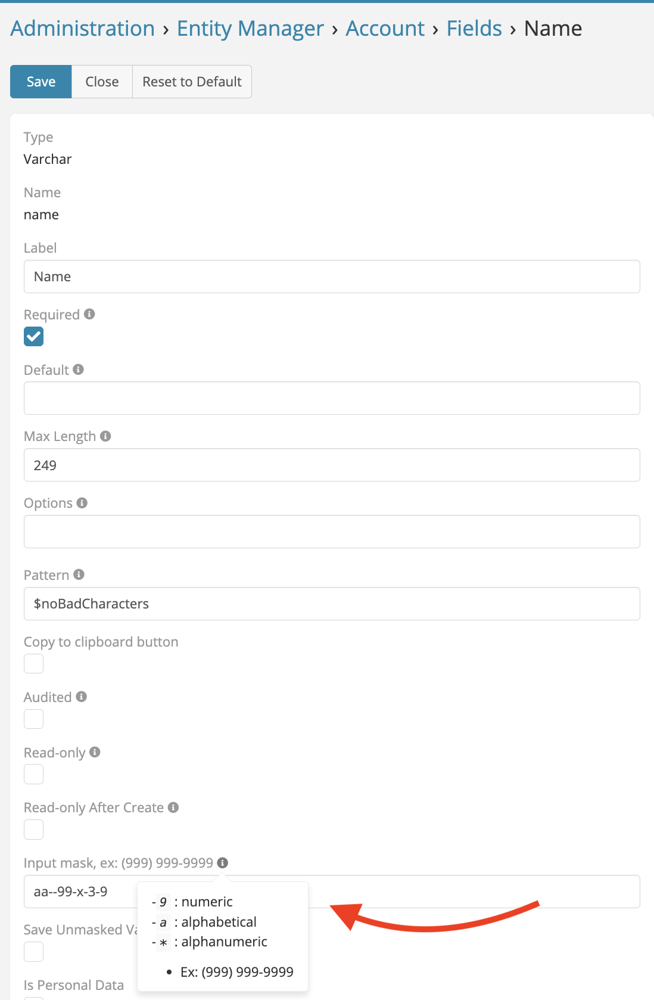

## Overview

> Ability set mask input for any existing varchar field (Phone & Varchar) in addition to the new fields.

---

<iframe width="650" height="315" src="https://www.youtube.com/embed/q1HM6IPTw_w" frameborder="0" allow="accelerometer; autoplay; clipboard-write; encrypted-media; gyroscope; picture-in-picture" allowfullscreen></iframe>

 

** [Changelog](changelog.md) **

## EspoCRM Mask

---
Go to **Administration** -> **Entity Manager** -> **{Entity Type}** -> **Fields(Varchar & Phone)**.

 

###  [ChangeLog](changelog.md) 

