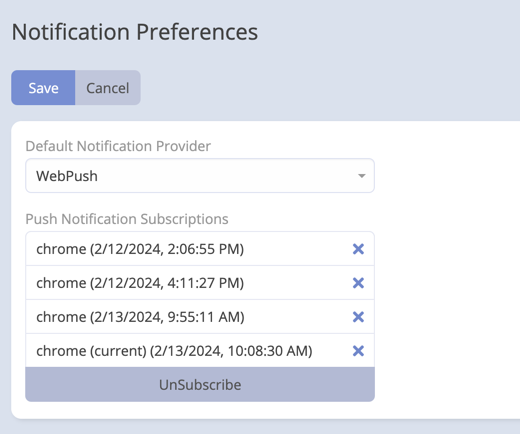
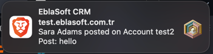

# WebPush Provider Overview

The WebPush provider in the Mobile App extension for EspoCRM allows you to leverage WebPush technology to send real-time
push notifications to users, enhancing their experience and keeping them informed.

 

## What is WebPush?

WebPush is a browser-based technology that enables websites and web applications to send push notifications to users,
even when the website or application is not open. With WebPush, users can receive timely updates, alerts, and messages
directly on their devices, contributing to a more engaging and dynamic user experience.

## Key Features

### 1. Real-Time Notifications

- Instantly notify users about important events or updates, ensuring they stay informed without actively using the
  EspoCRM application.

### 2. VAPID Support

- Utilize the Voluntary Application Server Identification (VAPID) protocol for secure and authenticated communication
  between the server and the push service.

### 3. User Permission Management

- Ensure users have control over their notification preferences. They can grant or deny permission to receive push
  notifications, providing a personalized experience.

### 4. Configuration Flexibility

- Easily configure and manage the WebPush provider settings, including VAPID keys and other parameters, through the
  EspoCRM administration panel.

### 5. Mark as Read

- Users can mark notifications as read from the notification list.

## Getting Started with WebPush

To enable WebPush for your EspoCRM instance, go to [setup](setup.md) and follow steps.
