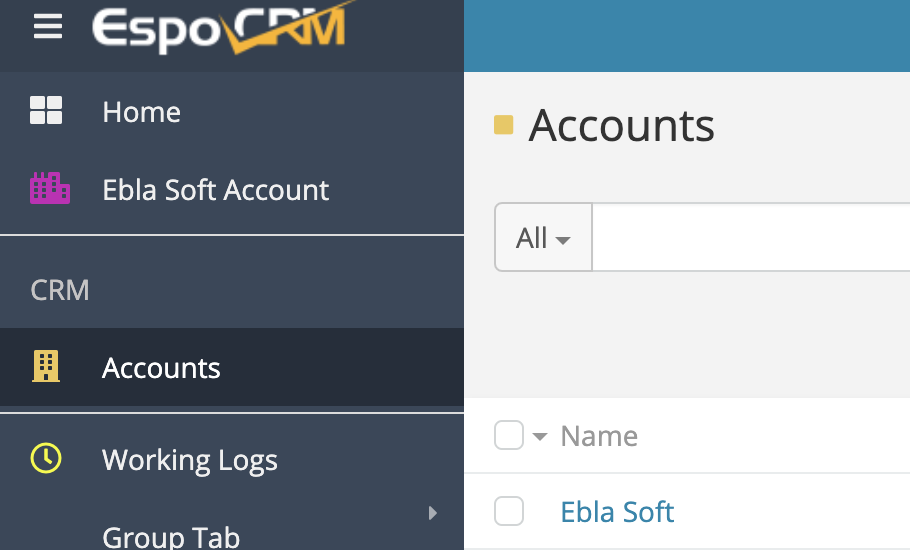
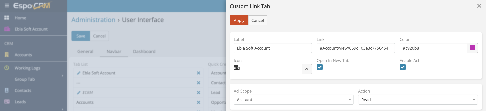

# Add Custom Links with Tabs 

>Ability to add custom links to navigation menu in EspoCRM is available
in [Ebla Navigation Pro](https://www.eblasoft.com.tr/espocrm-extension-page/espocrm-navigation-pro).

---

---

go to **Administration** -> **User Interface** -> **Navbar** -> **Add Custom Link** .

