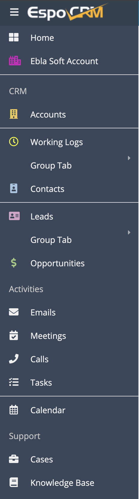
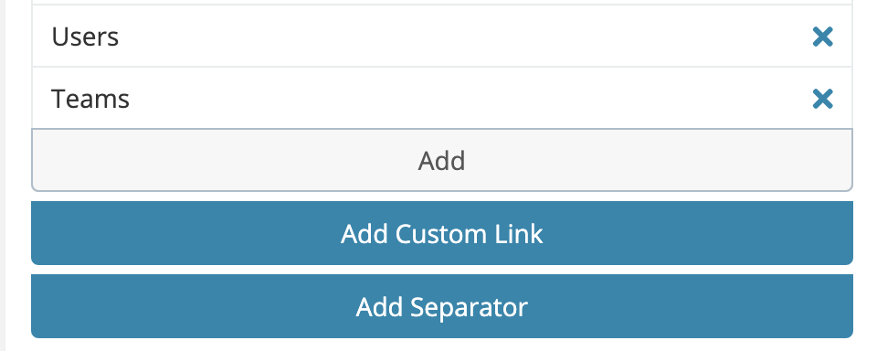

# Separator

> The separator is a simple divider that can be used to separate navigation items.
> is available in [Ebla Navigation Pro](https://www.eblasoft.com.tr/espocrm-extension-page/espocrm-navigation-pro).

---

---
go to **Administration** -> **User Interface** -> **Navbar** -> **Add Separator** .

