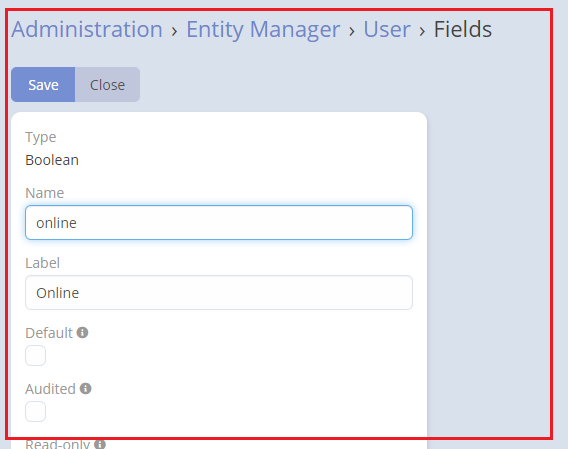
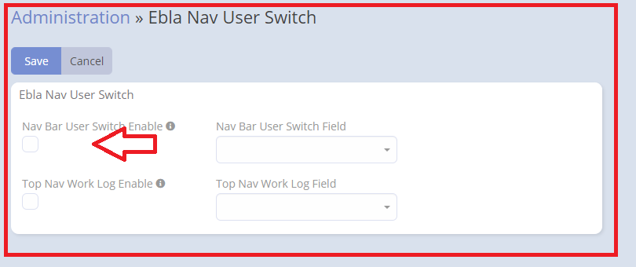
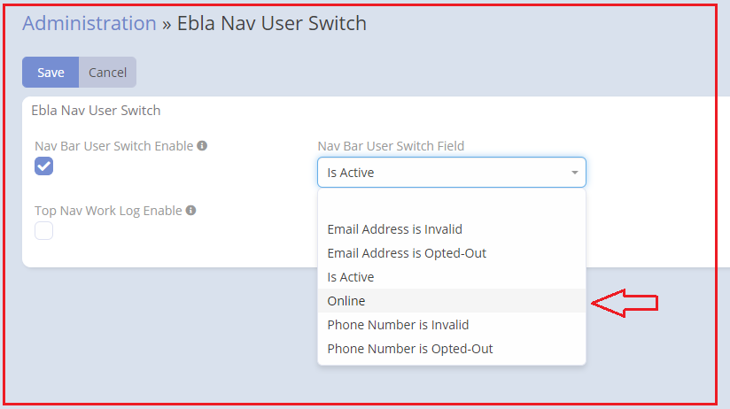

# Ebla Nav USer Switch Button . Nav Bar User Switch Button

### This feature facilitates the addition of a toggle button on the top navigation bar, allowing for the switching of a boolean field within the user's entity (Online - Offline).

### How to use

1. Go to **Admin** -> **Entity Manager** -> **User** -> **Fields** -> **Add Field** -> **( Boolean Type )**.

2. Go to **Admin** -> **Ebla Extensions** -> **Nav Bar User Switch**.

3. Enable **Nav Bar User Switch Enable**.

4. Select the **field type boolean**.

### Result:

1. **Online**

2. **Offline**

