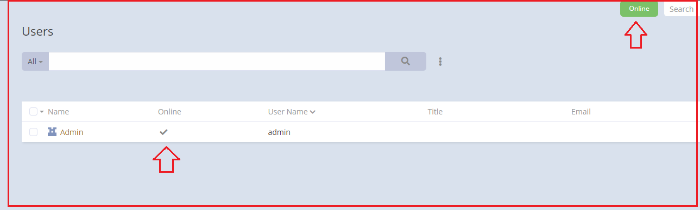
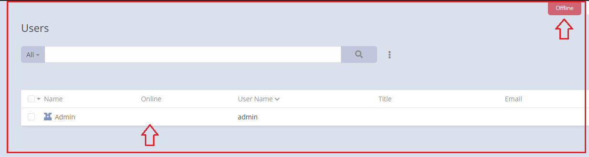

# Ebla Nav USer Switch Button

#### Type : Extension

[//]: # (#### Demo : [Demo]&#40;https://demo.eblasoft.com.tr/#Task/create&#41;)

* This feature facilitates the addition of a toggle button on the top navigation bar, allowing for the switching of a
  boolean field within the user's entity.
* This feature calculates the number of working hours per day.

[//]: # (<iframe width="650" height="315" src="https://www.youtube.com/embed/ID" frameborder="0" allow="accelerometer; autoplay; clipboard-write; encrypted-media; gyroscope; picture-in-picture" allowfullscreen></iframe>)

#### after installing the extension,

1. go to **Admin** -> **Ebla Extensions**.

### The Features

[Nav Bar User Switch Button](nav-bar-user-switch-button/nav-bar-user-switch-button.md)

[Top Nav Work Log Button](top-nav-work-log-button/top-nav-work-log-button.md)

