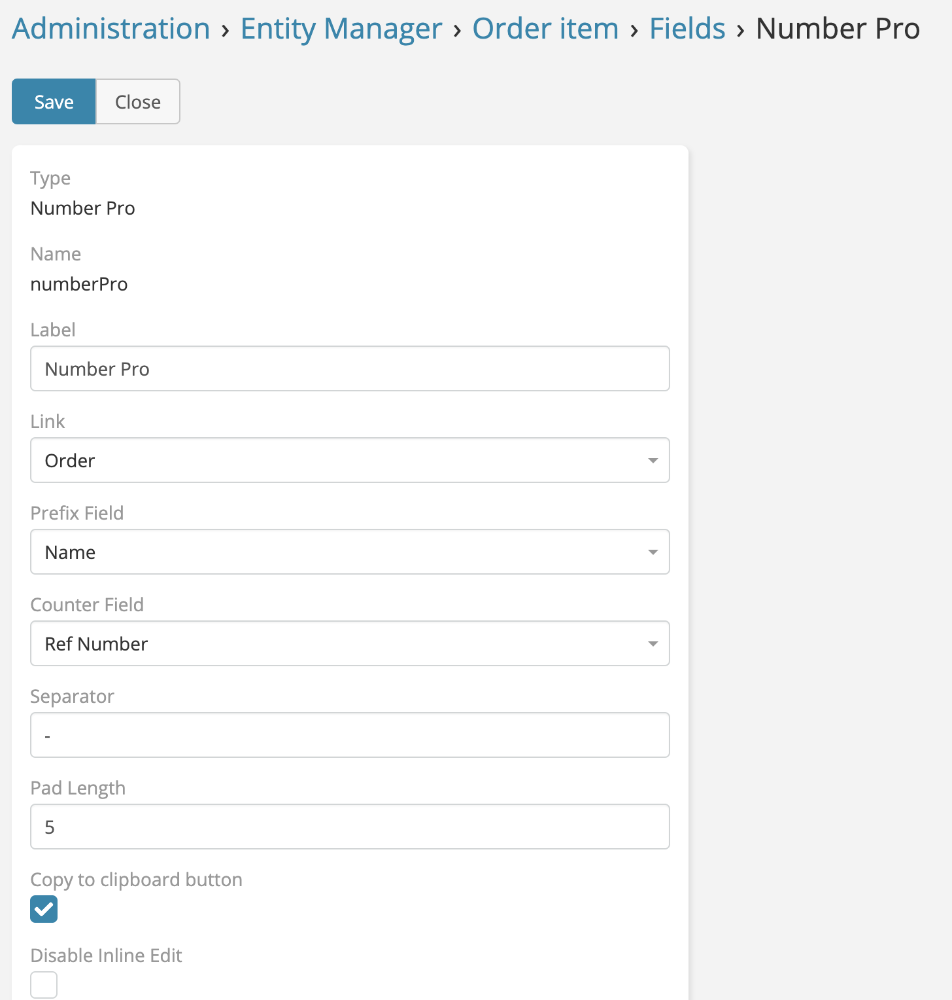

# Number Pro Field 

> Auto Increment (**Number Pro field**) available
> in [Ebla Number Pro](https://www.eblasoft.com.tr/espocrm-extension-page/number-pro).

---

---

1. Go to **Administration** -> **Entity Manager** -> **{Entity Type}** -> **Fields** .
2. Create a new field with type **Number Pro**.

