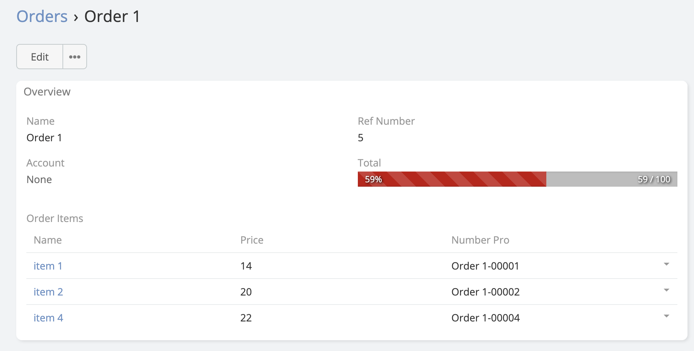
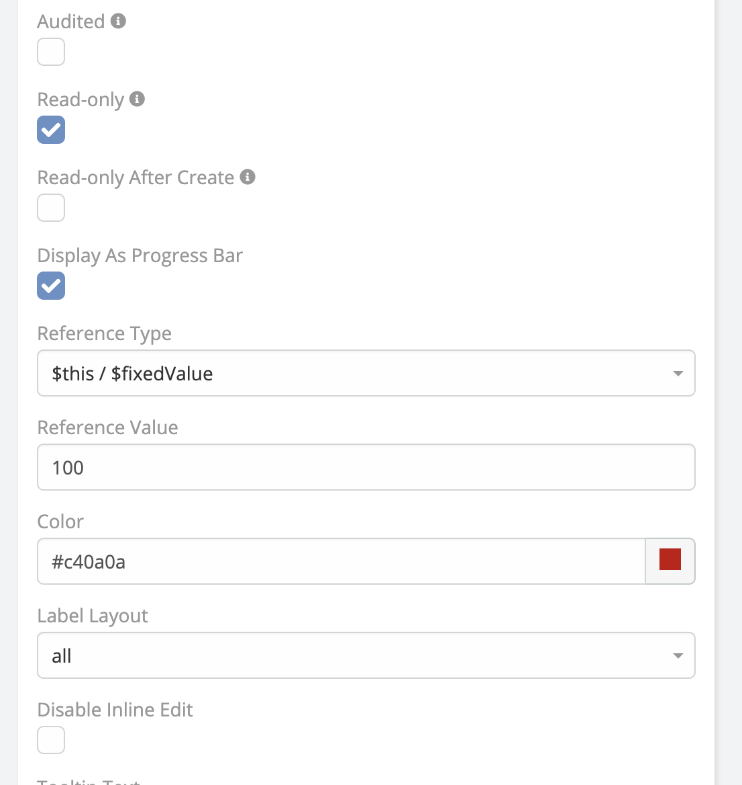

# Progress Bar 

> Progress bar is a simple extension that allows you to display a progress bar in your fields type(**Integer , Float ,
> Currency**) in the (**List, Detail**)  view in EspoCRM is available
> in [Ebla Progress Bar](https://www.eblasoft.com.tr/espocrm-extension-page/progress-bar).

---

---

**-** Go to **Administration** -> **Entity Manager** -> **{Entity Type}** -> **Fields** -> **Create Field type (Integer ,
   Float , Currency)** -> **Display As Progress Bar**.

 

###  [ChangeLog](changelog.md) 