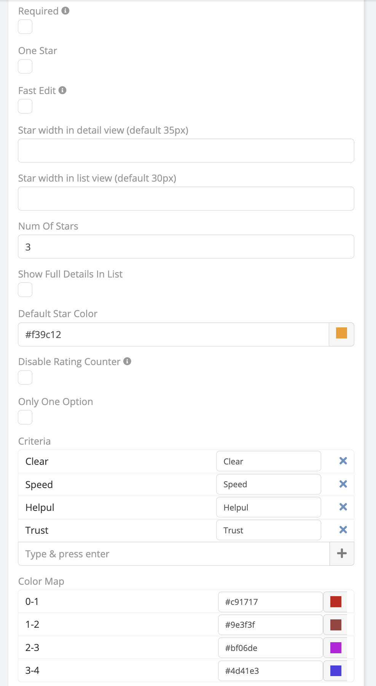

# Ebla Rate.

> adding new field type **Rate Field**, to allow EspoCRM users easily seat and read rates,
> is available in [Ebla Rate](https://www.eblasoft.com.tr/espocrm-extension-page/espocrm-rate-field).

---

<iframe width="650" height="315" src="https://www.youtube.com/embed/C505B7OBZmM" frameborder="0" allow="accelerometer; autoplay; clipboard-write; encrypted-media; gyroscope; picture-in-picture" allowfullscreen></iframe>

1. go to **Admin** -> **Entity Manager** -> **{Entity Type}** -> **Fields** -> **Add Field** -> **Rate field**.

 

###  [ChangeLog](changelog.md) 