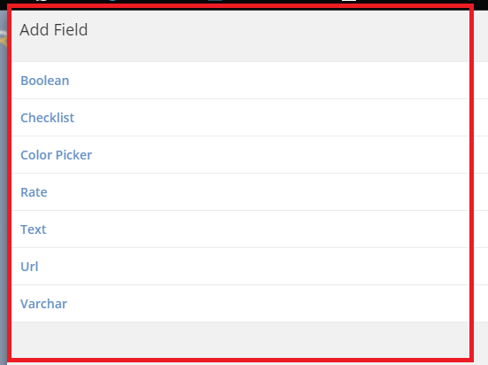
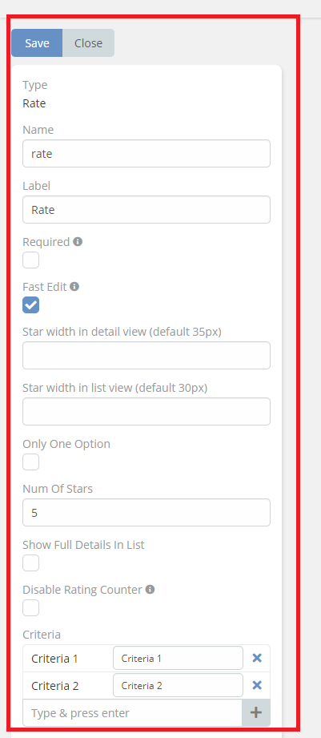
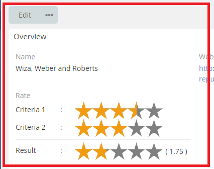

# Rate Field

#### this feature enables you to add a field rate .

### How to use it

1. go to **Admin** -> **Entity Manager** -> **Scope** -> **Fields** -> **Add Field** -> **Rate field**.

### Result:
