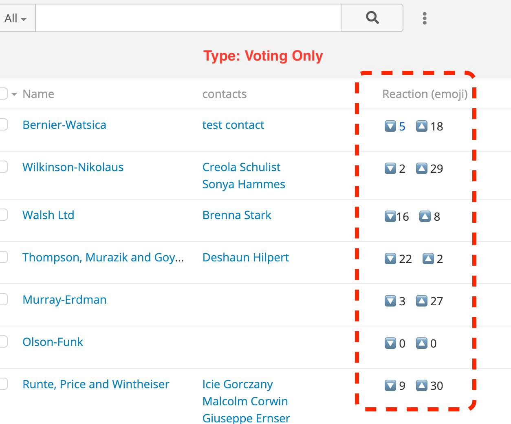

> Voting Only is available in [Ebla Reactions](https://www.eblasoft.com.tr/espocrm-extension-page/reactions).

---

---

1. Go to **Administration** -> **Entity Manager** -> **{Entity Type}** -> **Fields** -> **Create Field type Reactions(
   emoji)**.
2. Select **type** as **Voting Only**.

---

 

** [Changelog](changelog.md) **