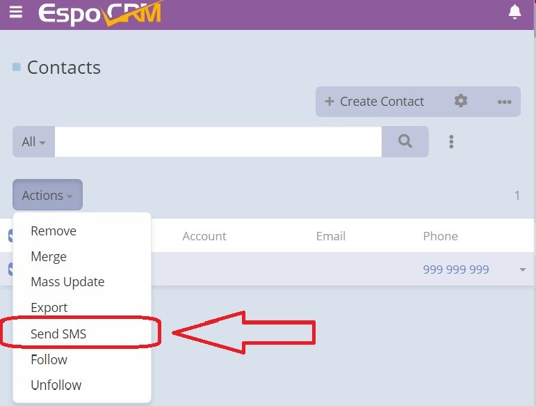
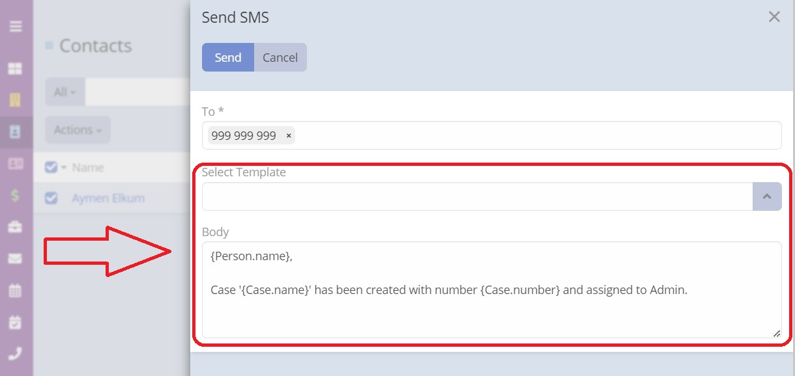
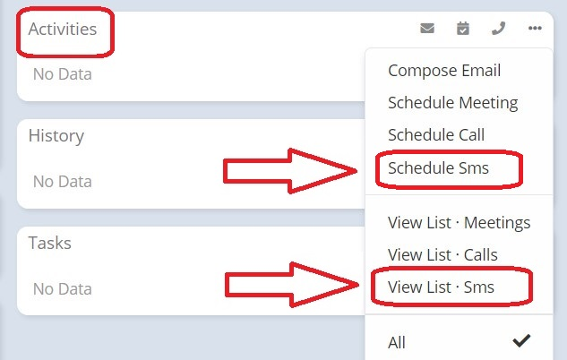
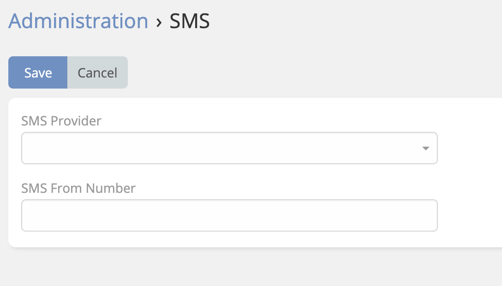

# SMS 

> This extension enables SMS Entity.
> Read more about SMS [EspoCRM SMS Sending](https://docs.espocrm.com/administration/sms-sending/).
> is available in [Ebla SMS](https://www.eblasoft.com.tr/espocrm-extension-page/sms).

---

1. **Enable** SMS Entity.
2. **Mass** SMS sending.
3. SMS **templates**.
4. Add SMS in **Activity panel**.

---

1. **Administration -> Integration** open the needed SMS provider and entered required credentials.
2. go to **Administration -> SMS** select the needed SMS provider. Specify **From Number** (if needed).

Supported SMS Providers:
> - Twilio
> - Spryng
> - sms77
> - smstools
> - SerwerSms
> - Verimor

---

** [Changelog](changelog.md) **

