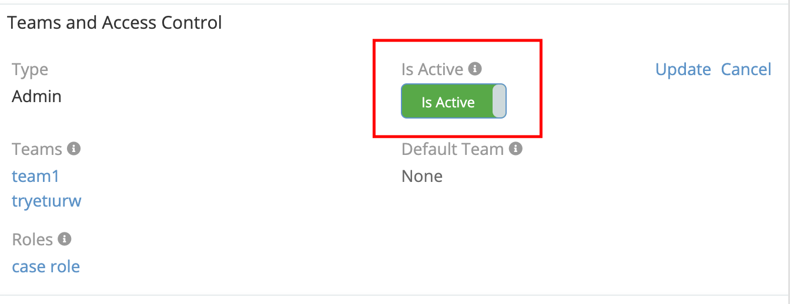
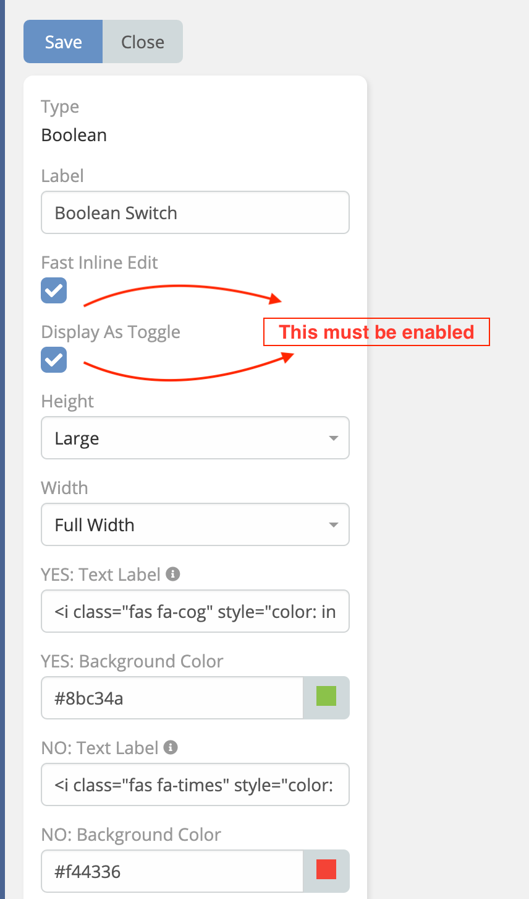

# Switch 

> Bool fields as toggle buttons in EspoCRM is available in [Ebla Switch](https://www.eblasoft.com.tr/espocrm-extension-page/switch).

---

---

1. Go to **Administration** -> **Entity Manager** -> **{Entity Type}** -> **Fields** -> **Create Field type (Bool)** -> **Display As Switch**.

 

** [Changelog](changelog.md) **

