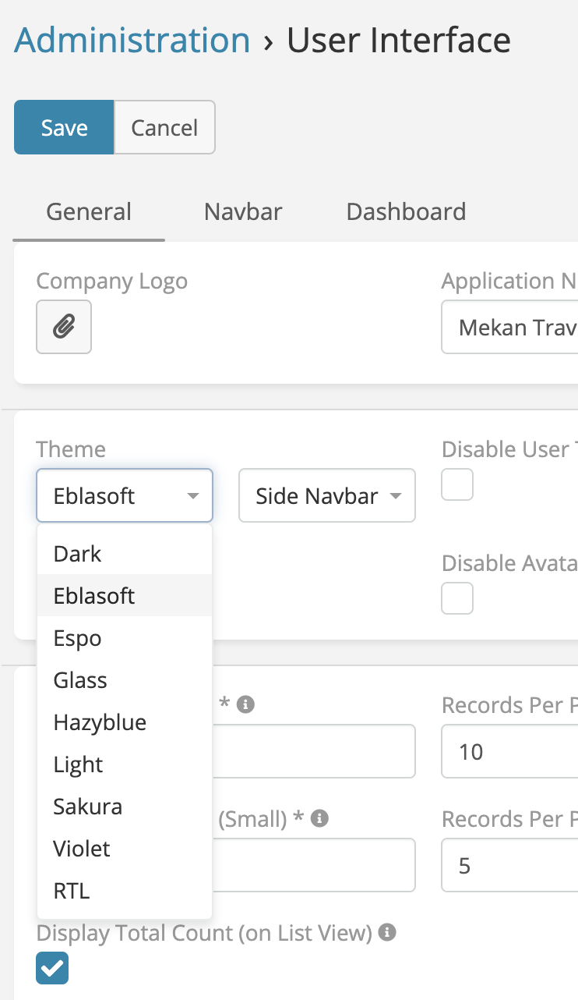
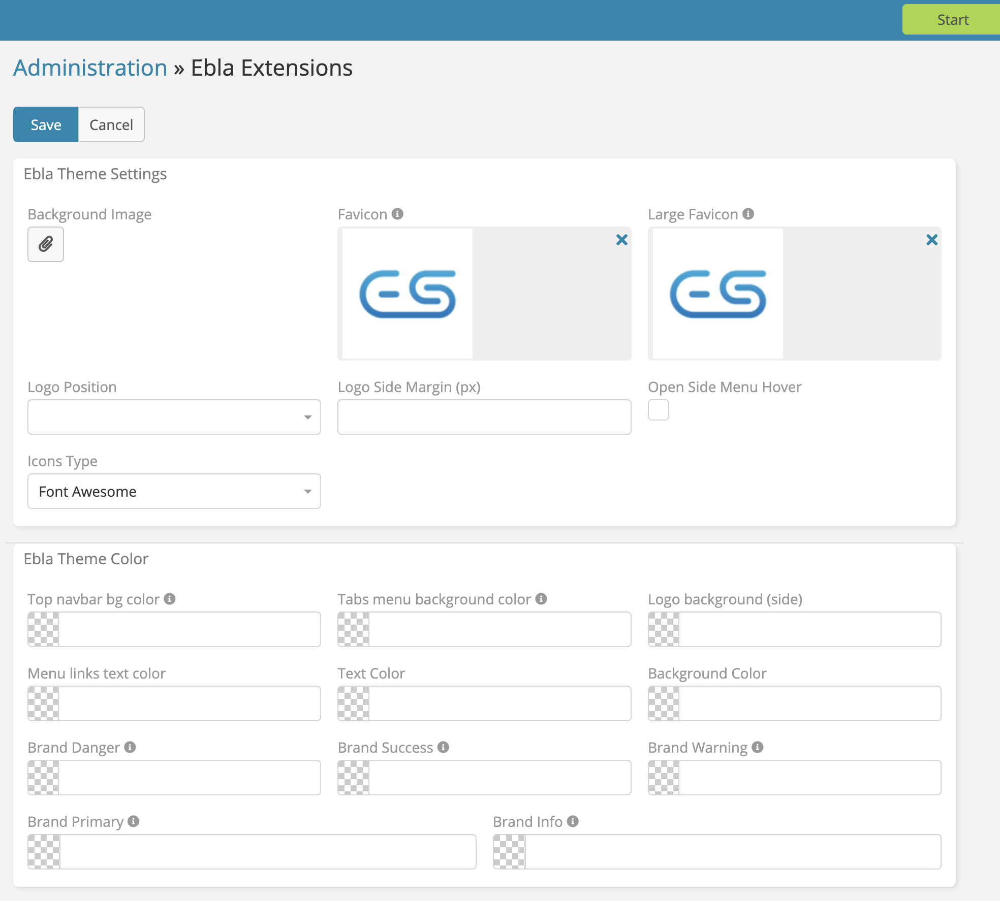

# Ebla Theme

> Add new theme to EspoCRM.
> Ebla Theme is available in [Ebla Theme](https://www.eblasoft.com.tr/espocrm-extension-page/espocrm-ebla-theme).

---

<iframe width="650" height="315" src="https://www.youtube.com/embed/UJX262flBZw" frameborder="0" allow="accelerometer; autoplay; clipboard-write; encrypted-media; gyroscope; picture-in-picture" allowfullscreen></iframe>

 

---

## Features

* New theme (**Eblasoft**)
* Add login Background Image.
* Add Favicon.
* Logo Position : center - left - right.
* Open Side Menu Hover.
* Ability to change Colors:
    - Top navbar color
    - Tabs menu background color
    - Logo background (side).
    - Text Color.
    - Brand Info.
    - Brand Danger.
    - Background Color.
    - Brand Success
    - Brand Warning
    - Brand Primary

go to **Administration** -> **Ebla Theme**

 

** [Changelog](changelog.md) **

