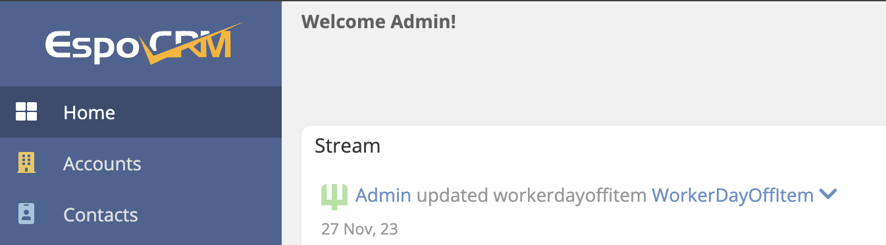
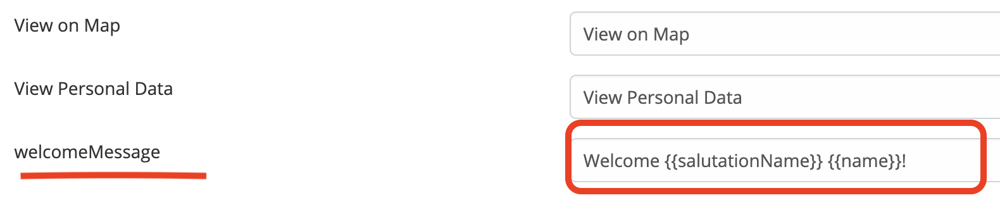

# Welcome Message

>  To display translatable welcome message on the top navbar in EspoCRM is available in [Ebla Welcome Message](https://www.eblasoft.com.tr/espocrm-extension-page/welcome-user-on-navbar).

---

---
For edit welcome message go to **Administration** -> **Label Manager** -> **Global** -> **labels** -> **welcomeMessage**.

---

 

** [Changelog](changelog.md) **